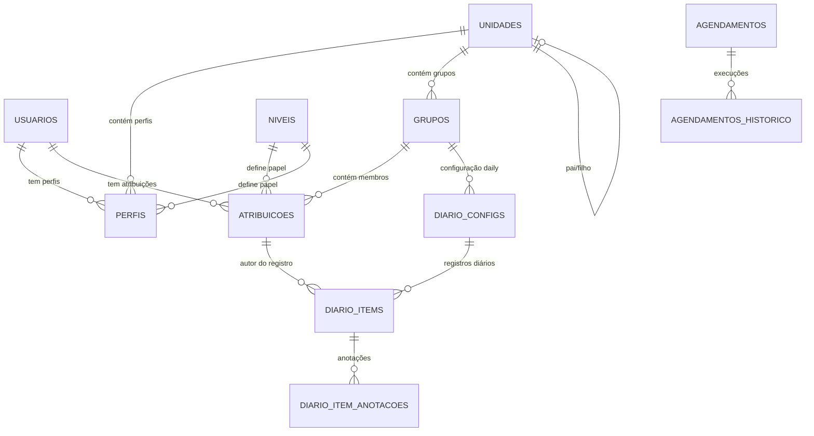

# 📋 AGENTS.md — Goal Getter Backend

> [!NOTE]
> Este arquivo documenta as **regras de negócio**, domínios funcionais, fluxos de dados e glossário do sistema **Goal Getter**.
> Para diretrizes técnicas de implementação (stack, padrões de código, segurança), consulte o [AGENTS-BACKEND.md](./AGENTS-BACKEND.md).

---

## 🎯 Visão Geral do Sistema

O **Goal Getter** é um sistema de gestão de equipes e acompanhamento de atividades diárias (daily stand-up digital) para a UFPI. Ele permite:

- Organizar **unidades organizacionais** e **grupos de trabalho**
- Atribuir **papéis hierárquicos** (gestores e participantes) a cada grupo
- Registrar **anotações diárias** (o que fez hoje, ontem e impedimentos)
- Gerar **relatórios** de atividade por período
- Integrar com sistemas externos (**Petrvs**, **Redmine**, **Chat UFPI**)
- Gerenciar **agendamentos** de notificações

---

## 📖 Glossário de Domínio

| Termo | Descrição |
|---|---|
| **Unidade** | Unidade organizacional da UFPI (ex: NTI, STI). Pode ter hierarquia pai/filho |
| **Grupo de Trabalho** | Equipe dentro de uma unidade, contém membros com papéis definidos |
| **Atribuição** | Vínculo de um usuário a um grupo com um nível específico (gestor ou participante) |
| **Perfil** | Vínculo de um usuário a uma unidade com um nível específico (chefe de unidade) |
| **Nível** | Papel hierárquico. Dois tipos: `PERFIL` (unidade) e `ATRIBUICAO` (grupo) |
| **Diário (Daily)** | Registro diário de atividades de um membro do grupo |
| **Anotação** | Entrada individual dentro de um diário, categorizada por tipo |
| **Config Daily** | Configuração de regras do diário para um grupo específico |
| **Agendamento** | Configuração de envio programado de notificações |
| **Petrvs** | Sistema de transparência da UFPI que fornece entregas de planos de trabalho |

---

## 🏗️ Domínios Funcionais

### 1. Gestão de Usuários

#### Regras de Negócio
- Cada usuário tem um `usuario` (login) **único** no sistema (case-insensitive na autenticação)
- A senha é armazenada como hash bcrypt, **nunca em texto plano**
- O campo `is_autorizado` controla se o usuário pode acessar o sistema (mesmo com credenciais válidas)
- O campo `inativo` implementa **soft delete** — usuários inativos não aparecem em listagens e não podem autenticar
- O campo `is_admin` controla acesso a operações administrativas (criar usuários, níveis, etc.)
- **Apenas administradores** podem criar novos usuários

#### Fluxo de Autenticação
```
1. POST /api/auth/login {usuario, senha}
2. Busca usuário por login (case-insensitive)
3. Verifica senha via bcrypt
4. Verifica: is_autorizado == true AND inativo == false
5. Gera JWT com {sub: user_id, role: "admin"|"user", exp: 120min}
6. Retorna {token, user: {id, nome, usuario, email, cpf, is_admin, perfis}}
```

> [!IMPORTANT]
> O token JWT **nunca** contém dados sensíveis (senha, CPF completo). O `sub` contém o UUID do usuário.

---

### 2. Hierarquia Organizacional

#### Modelo de Dados
```
Unidade (ex: NTI)
├── Unidade Filha (ex: Divisão de Desenvolvimento) [via id_unidade_pai]
├── Perfil (vínculo Usuário ↔ Unidade ↔ Nível)
└── Grupo de Trabalho (ex: Equipe Frontend)
    └── Atribuição (vínculo Usuário ↔ Grupo ↔ Nível)
```

#### Níveis do Sistema (seedados na inicialização)

| Nome | Tipo | Valor | Uso |
|---|---|---|---|
| Chefe de Unidade | `PERFIL` | 101 | Vincular usuário a uma unidade como gestor |
| Gestor de Grupo | `ATRIBUICAO` | 201 | Líder/chefe de um grupo de trabalho |
| Participante | `ATRIBUICAO` | 202 | Membro regular de um grupo de trabalho |

> [!IMPORTANT]
> Os valores numéricos (`101`, `201`, `202`) são **chaves de negócio** usadas na lógica de criação/atualização de grupos. Não altere sem atualizar o `grupo_service.py`.

#### Regras de Negócio — Unidades
- Unidades podem ter hierarquia (campo `id_unidade_pai` auto-referencial)
- Campos opcionais: `nome_ascii` (para busca sem acentos), `sigla`, `codigo`
- Soft delete via `inativo = True`
- Apenas administradores podem criar unidades

---

### 3. Gestão de Grupos de Trabalho

#### Criação de Grupo (CRÍTICO)

Ao criar um grupo dentro de uma unidade (`POST /api/unidades/{id}/grupos`):

1. **Recebe** listas de UUIDs:
   - `usuarios_chefes` → serão atribuídos com nível 201 (Gestor de Grupo)
   - `usuarios_participantes` → serão atribuídos com nível 202 (Participante)

2. **Validações obrigatórias**:
   - ⚠️ Pelo menos **1 chefe** é obrigatório
   - ⚠️ Pelo menos **1 participante** é obrigatório
   - ⚠️ Um usuário **não pode** estar em ambas as listas simultaneamente

3. **Processamento**:
   - Consulta tabela `niveis` para obter IDs dos níveis 201 e 202
   - Cria registros na tabela `atribuicoes` vinculando cada usuário ao grupo com o nível correto

#### Atualização de Grupo (CRÍTICO — Lógica de Diff)

Ao atualizar um grupo (`PUT /api/unidades/{uid}/grupos/{gid}`):

1. **Compara** atribuições existentes com as novas listas submetidas
2. **Lógica transacional**:
   - **Novos usuários** → cria nova `Atribuicao`
   - **Usuários removidos** → marca `inativo = True` na `Atribuicao` existente
   - **Mudança de papel** → atualiza `id_nivel` e reativa se estava inativo
3. **Toda a operação é atômica** (dentro de uma transação do banco)

```
Exemplo: Grupo com [Admin(201), João(202)]
Update com: {chefes: [Admin], participantes: [Maria]}
Resultado:
  - Admin: mantém como 201 (sem alteração)
  - João: inativo = True (removido)
  - Maria: nova Atribuicao com nível 202 (adicionada)
```

> [!WARNING]
> A validação de interseção entre chefes e participantes deve ser feita **antes** de qualquer escrita no banco. Caso contrário, o grupo ficaria em estado inconsistente.

---

### 4. Diário de Atividades (Daily Stand-up)

#### Estrutura
```
DiarioConfig (configuração por grupo)
└── DiarioItem (registro diário por usuário)
    └── DiarioItemAnotacao (anotações individuais)
```

#### Configuração do Diário (`DiarioConfig`)
- Cada grupo pode ter **uma** configuração de diário
- Campos configuráveis:
  - `periodo_addnota_inicio` / `periodo_addnota_fim` — janela horária para adicionar notas
  - `is_retroativo` — permite registros em datas passadas
  - `is_permite_atrasado` — permite marcar registro como atrasado
  - `is_publico_para_grupo` — todos do grupo veem os registros de todos
  - `canal_chatmessage` — canal para notificações de impedimento

#### Criação de Registro Daily (`DiarioItem`)

1. **Valida participação**: usuário deve ter uma `Atribuicao` ativa no grupo da config
2. **Unicidade**: apenas **1 registro por dia por config por usuário**
   - Verificado pela combinação `(id_diario_config, id_atribuicao_usuario, data_diario)`
3. **Anotações agrupadas por tipo** (dict com chaves `TODAY`, `YESTERDAY`, `IMPEDIMENT`):

```json
{
  "is_atrasado": false,
  "notas": {
    "TODAY": [
      {"descricao": "Implementei o módulo X", "id_tarefa": 1234}
    ],
    "YESTERDAY": [
      {"descricao": "Revisei PRs do time"}
    ],
    "IMPEDIMENT": [
      {"descricao": "Servidor de HMG fora do ar"}
    ]
  }
}
```

#### Tipos de Anotação (`TipoDiarioItemAnotacaoEnum`)

| Tipo | Significado | Integração |
|---|---|---|
| `TODAY` | O que fez/fará hoje | Redmine (se `id_tarefa` preenchido) |
| `YESTERDAY` | O que fez ontem | Redmine (se `id_tarefa` preenchido) |
| `IMPEDIMENT` | Bloqueios e impedimentos | Chat webhook (notificação automática) |

#### Atualização de Registro Daily

- **Estratégia replace-all**: desativa todas as anotações existentes e cria as novas
- Atualiza campo `is_atrasado` do item
- Operação transacional

#### Relatório de Atividades

- Endpoint `GET /api/daily/configs/{id}/relatorio?inicio=YYYY-MM-DD&fim=YYYY-MM-DD&grupo={id}`
- Retorna dados **agrupados por nome do usuário**
- Formato: `{ "João Silva": [{data_diario, notas}, ...], ... }`

---

### 5. Integrações Externas

Todas as integrações são **opcionais** e controladas por flags no `.env`.

#### 5.1 Petrvs (Sistema de Transparência UFPI)

| Configuração | Descrição |
|---|---|
| `PETRVS_ENABLED` | Ativa/desativa a integração |
| `PETRVS_API_URL` | URL base da API do Petrvs |

**Funcionalidades**:
- `GET /api/petrvs/entregas/{cpf}` — consulta todas as entregas de um servidor por CPF
- `GET /api/petrvs/entregas/ativas-hoje/{cpf}` — filtra entregas onde a data atual está dentro do intervalo `data_inicio ↔ data_fim`

> [!NOTE]
> Anotações diárias podem referenciar entregas do Petrvs via `petrvs_entrega_id` e `petrvs_entrega_desc`, permitindo vincular o daily a entregas formais do plano de trabalho.

#### 5.2 Redmine (Gerenciamento de Tarefas)

| Configuração | Descrição |
|---|---|
| `REDMINE_ENABLED` | Ativa/desativa a integração |
| `REDMINE_URL` | URL base do Redmine (ex: `https://projetos.ufpi.br`) |
| `REDMINE_API_KEY` | Chave API para autenticação |

**Comportamento**:
- Ao criar uma anotação daily com `id_tarefa` preenchido, o sistema envia automaticamente a `descricao` como nota na issue do Redmine (`PUT /issues/{id}.json`)
- Execução **best-effort** — falhas na integração não bloqueiam a criação do daily

#### 5.3 Chat UFPI (Webhook de Notificações)

| Configuração | Descrição |
|---|---|
| `CHAT_ENABLED` | Ativa/desativa o webhook |
| `CHAT_WEBHOOK_URL` | URL do webhook do Google Chat / similar |

**Comportamento**:
- Quando um registro daily contém anotações do tipo `IMPEDIMENT`, o sistema envia automaticamente uma mensagem no canal configurado
- Formato: `"⚠️ Impedimento reportado por {nome}: {descrição}"`
- Execução **best-effort** — falhas não bloqueiam a operação principal

---

### 6. Agendamentos

- CRUD administrativo para configurar envios programados de notificações
- Campos: `tipo`, `expressao_cron`, `canal`, `mensagem`
- Tabela de histórico (`agendamentos_historico`) registra cada execução com `sucesso` e `detalhes`
- **Apenas administradores** podem gerenciar agendamentos

> [!NOTE]
> O motor de execução dos cron jobs (scheduler) **não** está implementado neste backend. Os agendamentos são apenas configurações que podem ser consumidas por um serviço externo.

---

## 📐 Padrões de API

### Envelope de Resposta
Todas as respostas seguem o formato:
```json
{
  "success": true,
  "message": "Descrição da operação",
  "data": { ... }
}
```

### Paginação
Endpoints de listagem usam query params `page` (0-indexed) e `size`:
```json
{
  "items": [...],
  "count": 5,
  "page": 0,
  "size": 10,
  "totalPages": 1
}
```

### Soft Delete
- Nenhuma entidade é fisicamente deletada
- Desativação via `PUT /{id}/desativar` → marca `inativo = True`
- Listagens filtram por `inativo == False` por padrão
- Entidades desativadas podem ser reativadas atualizando `inativo = False`

### Segurança de Dados
- O campo `senha` **nunca** é retornado em respostas da API (excluído via schema `UsuarioResponse` e `__iter__` override no modelo)
- Todos os endpoints (exceto login) requerem token JWT válido no header `Authorization: Bearer {token}`

---

## 🗄️ Modelo de Dados (Visão Geral)



### Colunas de Auditoria (todas as tabelas)
| Coluna | Tipo | Descrição |
|---|---|---|
| `id` | UUID v4 | Primary key gerada automaticamente |
| `created_at` | DateTime | Data de criação (timezone America/Fortaleza) |
| `updated_at` | DateTime | Última atualização (nullable) |
| `ativo` | Boolean | Controle geral de ativação |
| `inativo` | Boolean | Soft delete (True = desativado) |

---

## 🔐 Matriz de Permissões

| Operação | Público | Usuário Logado | Admin |
|---|---|---|---|
| Login | ✅ | — | — |
| Listar usuários/unidades/grupos/níveis | ❌ | ✅ | ✅ |
| Ver detalhes | ❌ | ✅ | ✅ |
| Criar usuários | ❌ | ❌ | ✅ |
| Criar unidades | ❌ | ❌ | ✅ |
| Criar/editar níveis | ❌ | ❌ | ✅ |
| Criar/editar grupos | ❌ | ✅ | ✅ |
| Registrar daily | ❌ | ✅ (membro do grupo) | ✅ |
| Ver relatório daily | ❌ | ✅ | ✅ |
| Gerenciar agendamentos | ❌ | ❌ | ✅ |
| Consultar Petrvs | ❌ | ✅ | ✅ |

---

## 🌱 Seed de Dados Inicial

Na primeira execução (quando `DB_RUN_SEED=true`), o sistema cria automaticamente:

1. **3 Níveis padrão**: Chefe de Unidade (101), Gestor de Grupo (201), Participante (202)
2. **Usuário admin**: login `admin`, senha `admin`, com `is_admin=true` e `is_autorizado=true`

> [!WARNING]
> Altere a senha do admin imediatamente após o primeiro deploy em ambientes de homologação e produção.

O seeder é **idempotente** — execuções subsequentes verificam existência antes de inserir, evitando erros de constraint unique.
