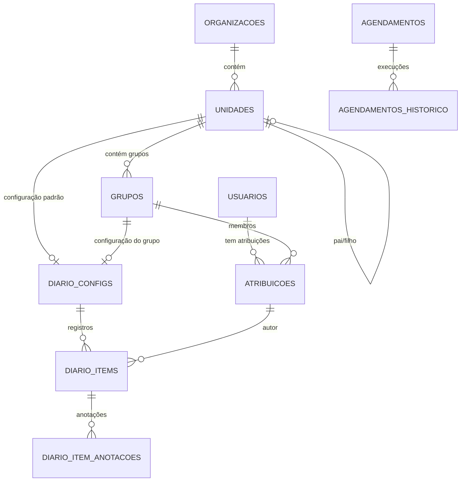

# 📋 AGENTS.md — Goal Getter Backend (Regras de Negócio)

> [!IMPORTANT]
> **RESTRIÇÃO DE ESCOPO DE WORKSPACE (REGRA ABSOLUTA)**:
> O agente JAMAIS deve consultar, inspecionar ou realizar modificações em projetos externos que não pertençam ao workspace ativo do usuário. Toda análise e alteração deve se restringir estritamente aos repositórios do workspace.

> [!IMPORTANT]
> **ISOLAMENTO ESTRITO DE MULTI-TENANCY (REGRA CRÍTICA ABSOLUTA)**:
> É ESTRITAMENTE PROIBIDO misturar ou retornar dados de uma Organização para solicitações de outra Organização. Todos os serviços, endpoints, consultas de banco de dados e componentes de frontend DEVEM obrigatoriamente filtrar todos os recursos (unidades, grupos, usuários, diários, agendamentos) pelo `id_organizacao` selecionado. Dados de organizações distintas JAMAIS podem vazar ou ser exibidos em conjunto.

> [!NOTE]
> Este arquivo documenta as **regras de negócio**, domínios funcionais, regras de auditoria e glossário do sistema **Goal Getter**.
> Para diretrizes técnicas de implementação (stack, padrões de código, ORM, migrações), consulte o [AGENTS-BACKEND.md](./AGENTS-BACKEND.md).

---

## 🎯 Visão Geral do Sistema

O **Goal Getter** é o sistema de acompanhamento de atividades diárias (digital daily stand-up) e gestão de equipes da UFPI. Ele permite:
- Organizar **unidades organizacionais** e **grupos de trabalho**.
- Atribuir **papéis hierárquicos** (gestores e participantes) a cada grupo e unidade.
- Registrar **anotações diárias** categorizadas (`TODAY`, `YESTERDAY`, `IMPEDIMENT`).
- Gerar **relatórios de produtividades** e integrar com **Petrvs**, **Redmine** e **Chat UFPI**.
- Executar **agendamentos programados** (cron jobs via APScheduler) com registro de histórico.

---

## 📖 Glossário de Domínio

| Termo | Descrição |
|---|---|
| **Unidade** | Unidade organizacional da UFPI (ex: NTI, STI). Suporta hierarquia pai/filho. |
| **Grupo de Trabalho** | Equipe vinculada a uma unidade, contendo membros com papéis definidos. |
| **Atribuição** | Vínculo entre Usuário, Grupo e Nível (`GESTOR_GRUPO` ou `PARTICIPANTE`). |
| **Perfil** | Vínculo entre Usuário, Unidade e Nível (`CHEFE_UNIDADE`). |
| **Nível** | Papel hierárquico padronizado pelo `NivelCodigoEnum` (101, 201, 202). |
| **Diário (Daily)** | Registro diário de atividades de um membro em um grupo/unidade. |
| **Config Daily** | Regras de registro diário. Pode ser definida por Grupo ou herdada da Unidade. |
| **Agendamento** | Envio automático programado de notificações com execução via APScheduler. |

---

## 🏗️ Domínios Funcionais & Regras de Negócio

### 1. Gestão de Usuários e Autenticação
- Login único case-insensitive; senha criptografada via **bcrypt**.
- `is_autorizado == True` e `inativo == False` são obrigatórios para autenticação.
- O JWT expira em 120min e contém apenas `{sub: user_id, role}` — dados sensíveis nunca trafegam no token.

### 2. Hierarquia e Configuração Herdada
- Unidades suportam estrutura em árvore (`id_unidade_pai`).
- **Herança de Configuração**: Se um Grupo não possuir `DiarioConfig` própria, o sistema utiliza a `DiarioConfig` associada à sua `Unidade` pai.

### 3. Grupos de Trabalho & `NivelCodigoEnum`
- Papéis definidos pela enum `NivelCodigoEnum`:
  - `CHEFE_UNIDADE` = `101` (Tipo `PERFIL`)
  - `GESTOR_GRUPO` = `201` (Tipo `ATRIBUICAO`)
  - `PARTICIPANTE` = `202` (Tipo `ATRIBUICAO`)
- **Criação/Edição de Grupos**: Exige pelo menos 1 chefe (201) e 1 participante (202). Um usuário não pode ocupar ambos os papéis no mesmo grupo. A atualização realiza diff atômico das atribuições.

### 4. Diário de Atividades & Soft Delete Parcial
- Cada membro pode registrar **1 diário por dia por configuração**.
- Categorias de anotações: `TODAY` (fará hoje), `YESTERDAY` (fez ontem), `IMPEDIMENT` (bloqueios).
- **Soft Delete e Unicidade**: A exclusão é lógica (`inativo = True`). Todas as restrições de unicidade (ex: `(id_diario_config, id_atribuicao_usuario, data_diario)`) utilizam **Índices Parciais** no banco (`WHERE inativo IS FALSE`) para permitir que registros reativados ou recriados não causem conflito.

### 5. Motor de Agendamentos (APScheduler)
- O backend possui um motor assíncrono interno de execução (`APScheduler`) inicializado no ciclo de vida da aplicação.
- Lê as expressões cron da tabela `agendamentos` e dispara webhooks/notificações, registrando cada execução em `agendamentos_historico`.

### 6. Integrações Externas (Opcionais & Best-Effort)
- **Petrvs**: Consulta entregas de planos de trabalho por CPF (`PETRVS_ENABLED`).
- **Redmine**: Envia notas automaticamente para issues via API (`REDMINE_ENABLED`).
- **Chat UFPI**: Notifica impedimentos (`IMPEDIMENT`) via webhook HTTP (`CHAT_ENABLED`).

---

## 🗄️ Modelo de Dados (Visão Geral)

```mermaid
erDiagram
    ORGANIZACOES ||--o{ UNIDADES : "contém"
    UNIDADES ||--o| UNIDADES : "pai/filho"
    UNIDADES ||--o{ GRUPOS : "contém grupos"
    UNIDADES ||--o| DIARIO_CONFIGS : "configuração padrão"
    GRUPOS ||--o| DIARIO_CONFIGS : "configuração do grupo"
    USUARIOS ||--o{ ATRIBUICOES : "tem atribuições"
    GRUPOS ||--o{ ATRIBUICOES : "membros"
    DIARIO_CONFIGS ||--o{ DIARIO_ITEMS : "registros"
    ATRIBUICOES ||--o{ DIARIO_ITEMS : "autor"
    DIARIO_ITEMS ||--o{ DIARIO_ITEM_ANOTACOES : "anotações"
    AGENDAMENTOS ||--o{ AGENDAMENTOS_HISTORICO : "execuções"
```

---

## 🔐 Matriz de Permissões

| Operação | Usuário Comum | Gestor de Grupo | Admin |
|---|---|---|---|
| Autenticação / Login | ✅ | ✅ | ✅ |
| Consultar Unidades / Grupos | ✅ | ✅ | ✅ |
| Criar / Editar Grupos | ❌ | ✅ (no seu grupo) | ✅ |
| Registrar Daily Stand-up | ✅ (se membro) | ✅ | ✅ |
| Gerenciar Agendamentos | ❌ | ❌ | ✅ |
| Criar Usuários / Unidades | ❌ | ❌ | ✅ |
